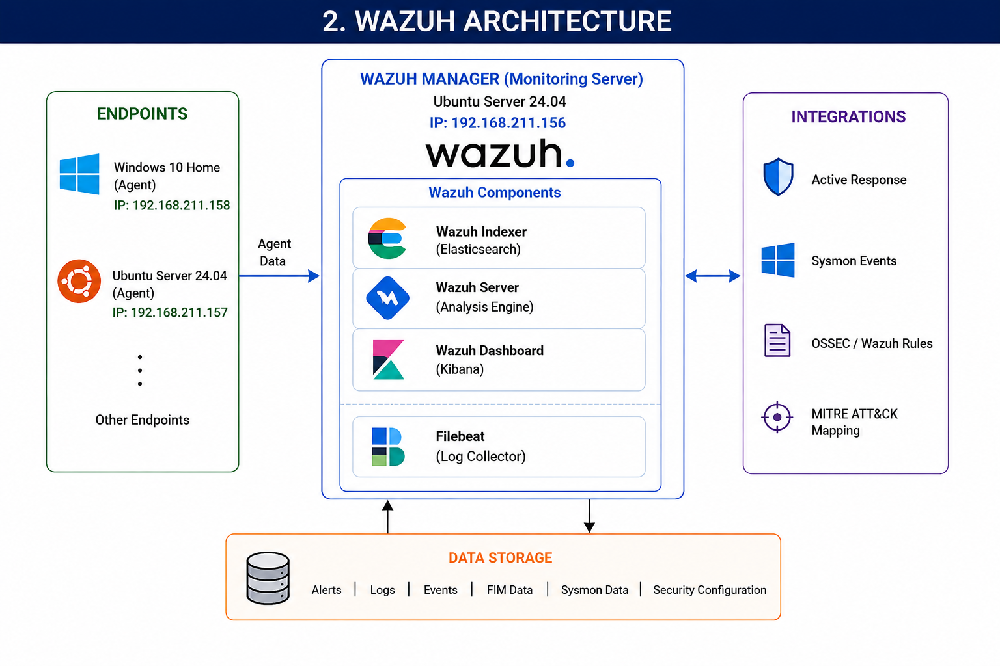
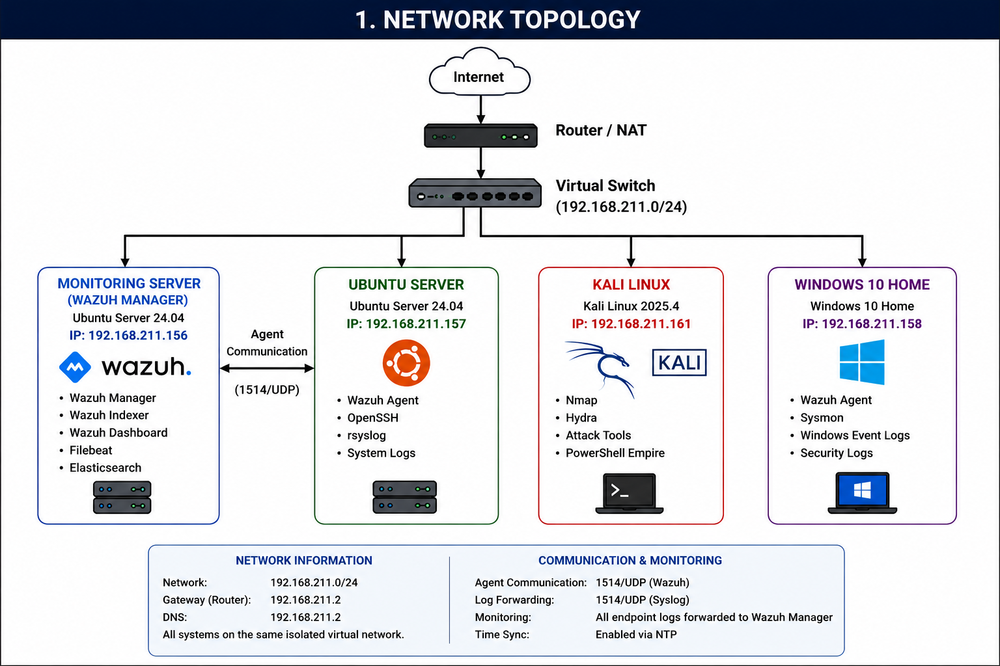
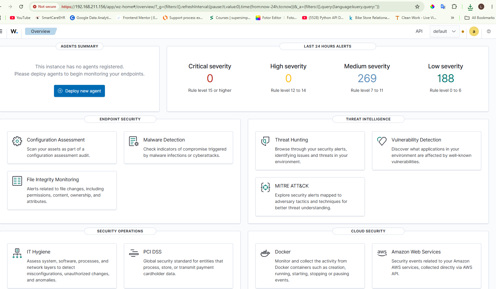
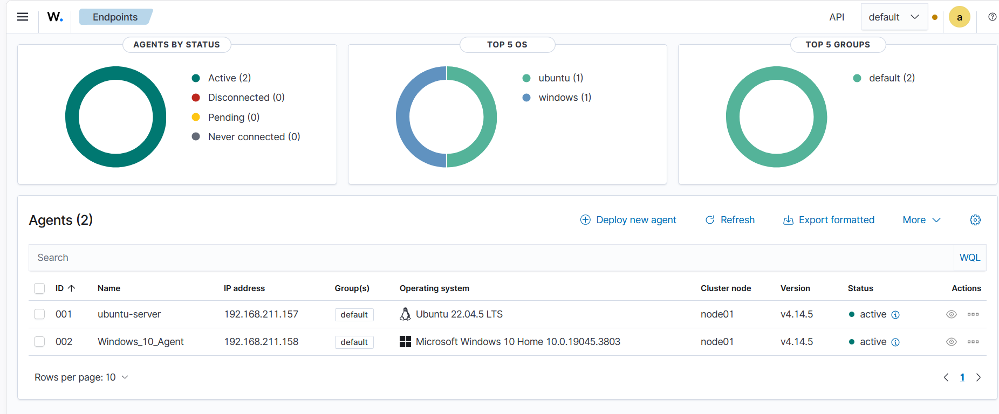

# Wazuh SOC Detection Homelab

A Wazuh-based SOC homelab for monitoring, threat detection, incident investigation, and automated response.

## Features

- Wazuh Manager, Indexer, and Dashboard
- Windows and Linux endpoint monitoring
- Custom detection rules
- MITRE ATT&CK mapping
- Incident investigation
- File Integrity Monitoring (FIM)
- Wazuh Active Response

## Why I Built This

This project was built to gain hands-on experience with Wazuh by simulating attacks, writing detection rules, investigating alerts, and implementing automated response.

## Lab Environment

| System | Role | IP Address |
| ----------------- | --------------------------------- | --------------- |
| Monitoring Server | Wazuh Manager, Indexer, Dashboard | 192.168.211.156 |
| Ubuntu Server | Linux Endpoint | 192.168.211.157 |
| Windows 10 Home | Windows Endpoint | 192.168.211.158 |
| Kali Linux 2025.4 | Attack Machine | DHCP |

The Wazuh Manager monitors two endpoints:

- ubuntu-server
- windows-endpoint

Kali Linux is used to simulate attacks.

## Architecture

The lab architecture consists of a Wazuh Manager and two monitored endpoints.





## Technologies Used

- VMware Workstation Pro
- Ubuntu Server 24.04 LTS
- Windows 10 Home
- Kali Linux 2025.4
- Wazuh
- Sysmon
- rsyslog
- OpenSSH
- MITRE ATT&CK Framework

## Attack Scenarios

| # | Attack | MITRE ATT&CK |
| - | ---------------------------- | ---------------- |
| 1 | SSH Brute Force | T1110 |
| 2 | Windows Reconnaissance | T1082, T1016 |
| 3 | Registry Run Key Persistence | T1547.001 |
| 4 | File Integrity Monitoring | T1222, T1485 |

## Detection Rules

Custom Wazuh rules used throughout the lab.

- [Rule Explanations](rules/rule-explanations.md)
- [Custom Rules](rules/custom-rules.xml)
- [Decoders](rules/decoders.xml)

## Investigation Reports

Each attack includes a corresponding investigation report.

- [SSH Brute Force Investigation](investigations/01-ssh-bruteforce.md)
- [Windows Reconnaissance Investigation](investigations/02-windows-reconnaissance.md)
- [Registry Persistence Investigation](investigations/03-registry-persistence.md)
- [File Integrity Monitoring Investigation](investigations/04-file-integrity-monitoring.md)

## Active Response

SSH brute-force attacks are automatically mitigated using Wazuh Active Response.

- [SSH IP Blocking with Wazuh Active Response](active-response/ssh-ip-blocking.md)

## Screenshots

### Wazuh Dashboard



### SSH Brute Force Detection


### Windows Reconnaissance Detection


### Connected Agents




## Repository Structure

```text
wazuh-soc-detection-homelab/
├── README.md
│
├── architecture/
│   ├── network-topology.png
│   └── wazuh-architecture.png
│
├── setup/
│   ├── monitoring-server.md
│   ├── ubuntu-server.md
│   ├── windows-endpoint.md
│   ├── kali-linux.md
│   ├── wazuh-installation.md
│   └── agent-deployment.md
│
├── attack-scenarios/
│   ├── 01-ssh-bruteforce.md
│   ├── 02-windows-reconnaissance.md
│   ├── 03-registry-persistence.md
│   └── 04-file-integrity-monitoring.md
│
├── investigations/
│   ├── 01-ssh-bruteforce.md
│   ├── 02-windows-reconnaissance.md
│   ├── 03-registry-persistence.md
│   └── 04-file-integrity-monitoring.md
│
├── active-response/
│   └── ssh-ip-blocking.md
│
├── rules/
│   ├── custom-rules.xml
│   ├── decoders.xml
│   └── rule-explanations.md
│
├── screenshots/
│   ├── agents-connected.png
│   ├── file-integrity-monitoring-alerts.png
│   ├── hydra-attack-blocked.png
│   ├── registry-persistence-alerts.png
│   ├── ssh-bruteforce-alerts.png
│   ├── ssh-bruteforce-hydra.png
│   ├── wazuh-active-response-alert.png
│   ├── wazuh-dashboard.png
│   ├── wazuh-login.png
│   ├── wazuh-services.png
│   └── windows-reconnaissance-alerts.png
│
└── notes/
    ├── lessons-learned.md
    └── recommendations.md
```

## Setup Documentation

- [Monitoring Server Setup](setup/monitoring-server.md)
- [Wazuh Installation](setup/wazuh-installation.md)
- [Ubuntu Server Setup](setup/ubuntu-server.md)
- [Windows Endpoint Setup](setup/windows-endpoint.md)
- [Kali Linux Setup](setup/kali-linux.md)
- [Agent Deployment](setup/agent-deployment.md)

## Setup Order

1. Monitoring Server Setup
2. Wazuh Installation
3. Ubuntu Server Setup
4. Windows Endpoint Setup
5. Kali Linux Setup
6. Agent Deployment
7. Attack Scenarios
8. Investigations
9. Active Response Configuration

## Author

**Princewill Nkemateh**