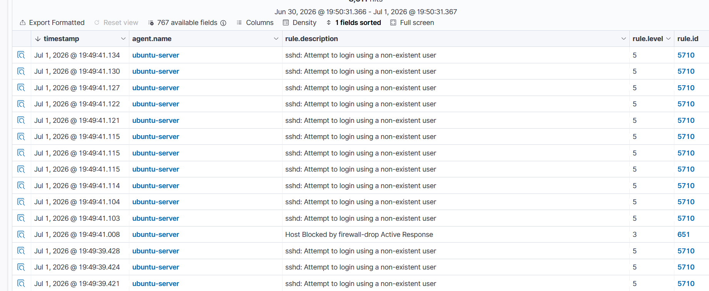
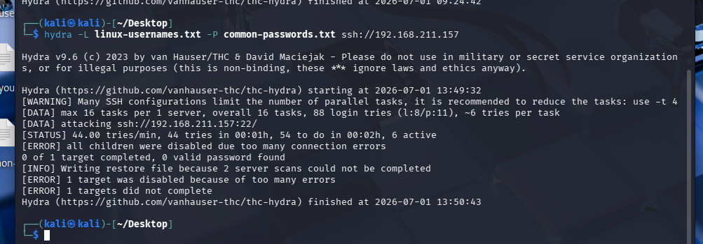

# SSH IP Blocking with Wazuh Active Response

## Objective

Configure Wazuh Active Response to automatically block the source IP after detecting an SSH brute-force attack.

## Configuration

### Command

```xml
<command>
    <name>firewall-drop</name>
    <executable>firewall-drop</executable>
    <timeout_allowed>yes</timeout_allowed>
</command>
```

### Active Response

```xml
<active-response>
    <command>firewall-drop</command>
    <location>local</location>
    <rules_id>5712</rules_id>
    <timeout>600</timeout>
</active-response>
```

Restart the Wazuh Manager after applying the configuration.

```bash
sudo systemctl restart wazuh-manager
```

## Validation

The SSH brute-force attack was executed using Hydra.

Expected workflow:

```text
Hydra
    ↓
Rule 5712 Triggered
    ↓
firewall-drop Executed
    ↓
Attacker IP Blocked
    ↓
Hydra Connection Fails
```

## Evidence

### Active Response Triggered

The Wazuh Dashboard generated **Rule 651 – Host Blocked by firewall-drop Active Response**, confirming that the configured response was executed.



### Attack Blocked

After the firewall rule was applied, Hydra was unable to continue the brute-force attack because the SSH connection was blocked.



## Result

The configured Active Response successfully blocked the attacking IP after detecting an SSH brute-force attack, preventing further authentication attempts.

## Related Files

- [SSH Brute Force Scenario](../attack-scenarios/01-ssh-bruteforce.md)
- [SSH Brute Force Investigation](../investigations/01-ssh-bruteforce.md)