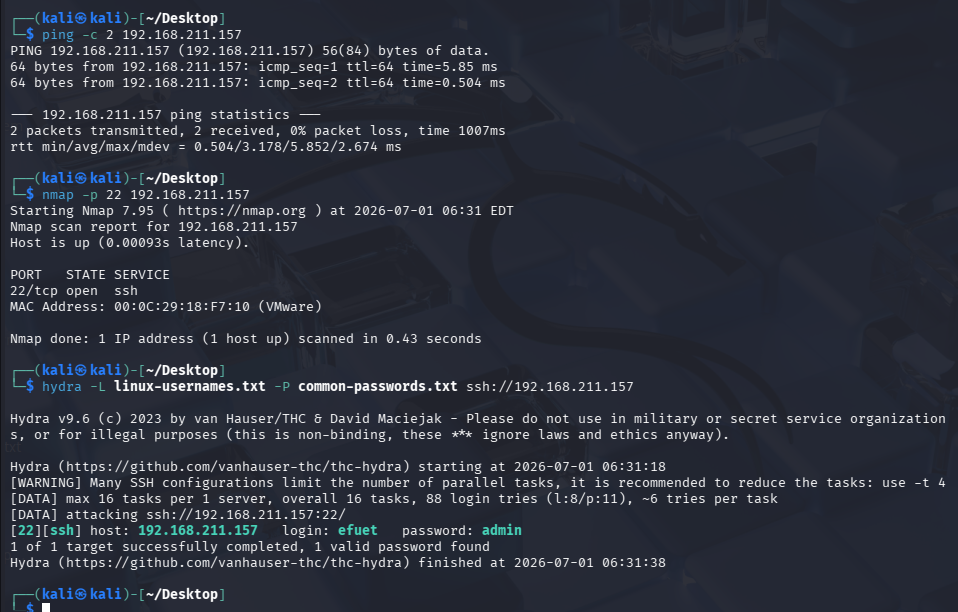

# SSH Brute Force

## Objective

Simulate an SSH brute-force attack against the Ubuntu server and validate Wazuh's detection capabilities.

## Target

| Property | Value |
|----------|-------|
| Host | ubuntu-server |
| IP Address | 192.168.211.157 |
| Operating System | Ubuntu Server 24.04 LTS |
| Service | SSH |
| Port | 22 |

## Attack Machine

| Property | Value |
|----------|-------|
| Host | Kali Linux 2025.4 |
| Tool | Hydra |

## MITRE ATT&CK

| Tactic | Technique | ID |
|----------|-----------|-----|
| Credential Access | Brute Force | T1110 |

## Attack Overview

A dictionary-based SSH brute-force attack was launched from Kali Linux against the Ubuntu server using Hydra.

## Network Reconnaissance

Verify the target is reachable and the SSH service is available.

```bash
ping -c 4 192.168.211.157

nmap -p 22 192.168.211.157
```

## Attack Resources

- **Username Dictionary:** Common Linux usernames, including the lab account.
- **Password Dictionary:** Common passwords with the valid password intentionally placed later in the list to generate sufficient authentication events.

## Attack Execution

```bash
hydra -L linux-usernames.txt -P common-passwords.txt ssh://192.168.211.157
```

## Expected Outcome

The attack generates repeated SSH authentication failures, allowing Wazuh to detect and correlate the activity.

## Evidence



## Related Investigation

- [SSH Brute Force Investigation](../investigations/01-ssh-bruteforce.md)