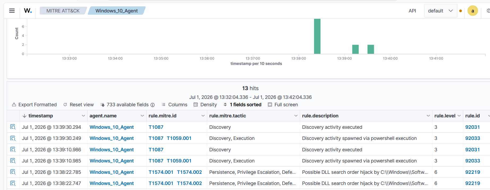

# Windows Reconnaissance

## Objective

Simulate common Windows reconnaissance activities and validate Wazuh's ability to detect discovery-related commands.

## Target

| Property | Value |
|----------|-------|
| Host | windows-endpoint |
| IP Address | 192.168.211.158 |
| Operating System | Windows 10 Home |
| Monitoring Agent | Wazuh Agent |
| Log Source | Sysmon |

## Attack Machine

| Property | Value |
|----------|-------|
| Host | windows-endpoint |
| Tool | Windows PowerShell |

## MITRE ATT&CK

| Tactic | Technique | ID |
|----------|-----------------------------------------------|-----------|
| Discovery | Account Discovery | T1087 |
| Discovery | System Information Discovery | T1082 |
| Discovery | System Network Configuration Discovery | T1016 |
| Discovery | Process Discovery | T1057 |
| Discovery | Network Service Discovery | T1046 |
| Execution | PowerShell | T1059.001 |

## Attack Overview

Native Windows commands were executed from PowerShell to enumerate system, user, process, and network information.

## Attack Execution

```powershell
hostname
whoami
systeminfo
ipconfig /all
arp -a
net user
net localgroup administrators
tasklist
netstat -ano
```

The commands generated Sysmon events that were collected and analyzed by Wazuh.

## Expected Outcome

Wazuh generates alerts for the executed reconnaissance commands, allowing the activity to be investigated.

## Evidence



## Related Investigation

- [Windows Reconnaissance Investigation](../investigations/02-windows-reconnaissance.md)