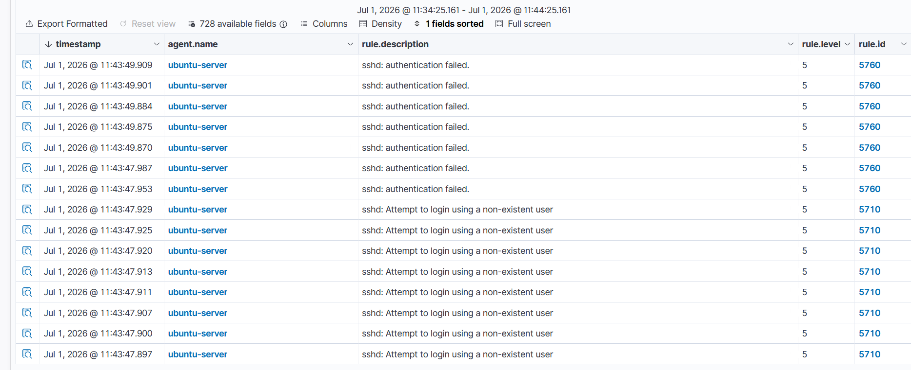

# Incident Report: SSH Brute Force Attack

## Summary

| Field | Detail |
|-------|--------|
| Incident Type | SSH Brute Force |
| Severity | Medium |
| MITRE ATT&CK | T1110 – Brute Force |
| Affected Host | ubuntu-server (192.168.211.157) |
| Detection Source | Wazuh Dashboard |
| Status | Investigated |

## Detection

A simulated SSH brute-force attack generated multiple authentication events on the Ubuntu server. Wazuh detected the activity and generated alerts for investigation.

### Detection Rules

| Rule ID | Level | Description |
|---------|------:|-------------|
| 5710 | 5 | sshd: Attempt to login using a non-existent user |
| 5760 | 5 | sshd: Authentication failed |

## Investigation

### Timeline

| Stage | Activity |
|-------|----------|
| Reconnaissance | Verified host availability with Ping |
| Service Discovery | Verified SSH service with Nmap |
| Attack Execution | Hydra launched the brute-force attack |
| Detection | Rule 5710 and Rule 5760 triggered |
| Investigation | Alerts reviewed in the Wazuh Dashboard |

### Findings

- Rule **5710** identified authentication attempts using non-existent usernames.
- Rule **5760** detected failed password attempts against a valid user account.
- The alert sequence matched a dictionary-based SSH brute-force attack.

### Indicators of Compromise (IOCs)

| Indicator | Value |
|-----------|-------|
| Attack Tool | Hydra |
| Target Host | ubuntu-server |
| Target IP | 192.168.211.157 |
| Service | SSH |
| Port | 22 |
| MITRE ATT&CK | T1110 |

## Impact Assessment

| Category | Assessment |
|----------|------------|
| Availability | No impact |
| Unauthorized Access | Not observed |
| Privilege Escalation | Not observed |
| Persistence | Not observed |
| Data Exfiltration | Not observed |

## Recommendations

- Enforce strong password policies.
- Use SSH key-based authentication.
- Configure account lockout or rate limiting.
- Restrict SSH access to trusted hosts or VPN users.
- Continue monitoring SSH authentication events with Wazuh.

## Lessons Learned

The investigation showed that Wazuh successfully detected and classified SSH brute-force activity. Correlating Rules **5710** and **5760** made it possible to reconstruct the attack and distinguish username enumeration from failed password attempts.

## Evidence

## Related Attack Scenario

- [SSH Brute Force](../attack-scenarios/01-ssh-bruteforce.md)