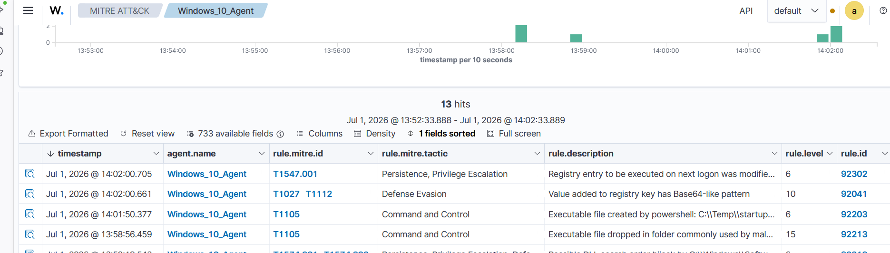

# Incident Report: Registry Persistence

## Summary

| Field | Detail |
|-------|--------|
| Incident Type | Registry Persistence |
| Severity | High |
| MITRE ATT&CK | T1547.001 – Registry Run Keys / Startup Folder |
| Affected Host | windows-endpoint (192.168.211.158) |
| Detection Source | Wazuh Dashboard |
| Status | Investigated |

## Detection

Wazuh detected registry modifications associated with a Windows **Run** key persistence technique. Additional alerts were generated for the creation of the startup script and the registry changes.

### Detection Rules

| Rule ID | Level | Description |
|---------:|------:|-------------|
| 92302 | 6 | Registry entry to be executed on next logon was modified |
| 92041 | 10 | Value added to registry key has Base64-like pattern |
| 92203 | 6 | Executable file created by PowerShell |
| 92213 | 15 | Executable file dropped in a folder commonly used by malware |

## Investigation

### Timeline

| Stage | Activity |
|-------|----------|
| File Creation | Startup batch file created |
| Registry Modification | Run key updated |
| Telemetry Collection | Sysmon captured the events |
| Detection | Wazuh generated persistence alerts |
| Investigation | Alerts reviewed in the Wazuh Dashboard |

### Findings

- PowerShell created a batch file and added it to the Windows **Run** registry key.
- Sysmon recorded both the file creation and registry modification events.
- Wazuh correlated the activity and generated persistence-related alerts.
- The batch file was created for demonstration purposes and did not execute malicious code.

### Indicators of Compromise (IOCs)

| Indicator | Value |
|-----------|-------|
| Host | windows-endpoint |
| IP Address | 192.168.211.158 |
| Process | Windows PowerShell |
| Registry Key | HKCU\Software\Microsoft\Windows\CurrentVersion\Run |
| Persistence Method | Registry Run Key |
| MITRE ATT&CK | T1547.001 |

## Impact Assessment

| Category | Assessment |
|----------|------------|
| Registry Modification | Observed |
| Startup Persistence | Established |
| Malicious Execution | Not observed |
| Privilege Escalation | Not observed |
| Data Exfiltration | Not observed |

## Recommendations

- Monitor registry modifications associated with persistence techniques.
- Review PowerShell activity for unauthorized registry changes.
- Restrict unnecessary PowerShell usage.
- Periodically review **Run** and **RunOnce** registry keys.

## Lessons Learned

Wazuh successfully detected and correlated registry modifications, file creation, and persistence activity, providing clear visibility into a common Windows persistence technique.

## Evidence

## Related Attack Scenario

- [Registry Persistence](../attack-scenarios/03-registry-persistence.md)