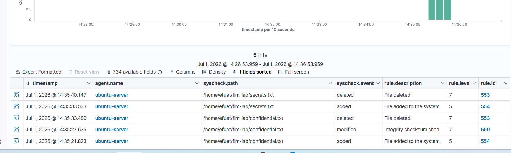

# Incident Report: File Integrity Monitoring

## Summary

| Field | Detail |
|-------|--------|
| Incident Type | File Integrity Monitoring |
| Severity | Medium |
| MITRE ATT&CK | T1222, T1485 |
| Affected Host | ubuntu-server (192.168.211.157) |
| Detection Source | Wazuh File Integrity Monitoring |
| Status | Investigated |

## Detection

Wazuh detected multiple file system events within a monitored directory, including file creation, modification, renaming, and deletion.

### Detection Rules

| Rule ID | Level | Description |
|---------:|------:|-------------|
| 554 | 5 | File added to the system |
| 550 | 7 | Integrity checksum changed (file modified) |
| 553 | 7 | File deleted |

## Investigation

### Timeline

| Stage | Activity |
|-------|----------|
| File Creation | `confidential.txt` created |
| File Modification | File content modified |
| File Rename | `confidential.txt` renamed to `secrets.txt` |
| File Deletion | `secrets.txt` deleted |
| Investigation | Alerts reviewed in the Wazuh Dashboard |

### Findings

- Wazuh detected every file operation within the monitored directory.
- File creation, modification, renaming, and deletion generated File Integrity Monitoring alerts.
- The alert sequence matched the simulated file activity performed during the test.

### Indicators of Compromise (IOCs)

| Indicator | Value |
|-----------|-------|
| Host | ubuntu-server |
| IP Address | 192.168.211.157 |
| Monitored Directory | `/home/efuet/fim-lab` |
| Activity | File Creation, Modification, Rename, Deletion |
| Detection Source | Wazuh File Integrity Monitoring |

## Impact Assessment

| Category | Assessment |
|----------|------------|
| File Creation | Observed |
| File Modification | Observed |
| File Rename | Observed |
| File Deletion | Observed |
| System Availability | No impact |
| Data Exfiltration | Not observed |

## Recommendations

- Monitor critical files and directories using Wazuh FIM.
- Restrict write permissions to sensitive files and directories.
- Investigate unexpected file modifications and deletions.
- Review File Integrity Monitoring alerts during threat hunting.

## Lessons Learned

Wazuh successfully detected and tracked the complete file lifecycle, providing clear visibility into file creation, modification, renaming, and deletion within the monitored directory.

## Evidence

## Related Attack Scenario

- [File Integrity Monitoring](../attack-scenarios/04-file-integrity-monitoring.md)